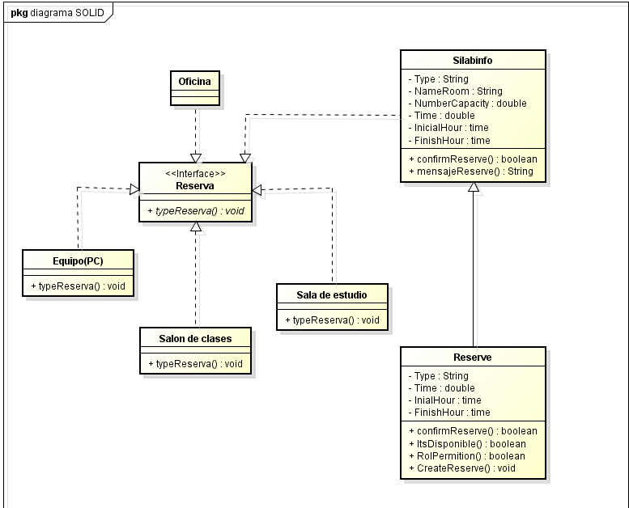

# DOSW_ParcialT1_JuanMoreno
primer parcial de ciclos Juan Moreno

## 1. Diagrama de contexto

## 2. Patrones de diseño elegidos
### Primero
a) nombre del patron: Factory method
b) tipo de patron: Creacional
c) Justificacion: ya que este patron es una "fabrica" por decirlo asi que crea todos los objetos, en este caso nuestra fabrica es la reservacion  los objetos que se crean son el area u objeto elegido como un salon, oficina o un equipo (PC)

### Segundo 
a) nombre del patron: Abstract factory
b) tipo de patron: Creacional
c) Justificacion: debido a que este patron nos permite crear familias de objectos que sean similares entre si, aqui todo lo que se reserva tienen aspectos en comun como ubicacion, capacidad, tiempo de reserva, etc.

## 3. requerimientos

### funcionales

Silabinfo tiene que tener la posibilidad de:

1. manejar distintos tipos de reserva dependiendo el lugar y quien lo solicita. (Patron de diseño)
2. gestionar el tiempo de cada reserva.
3. eliminar reservas anteriores, vencidas o canceladas con su respectiva razon.

### no funcionales 

Silabinfo debe:

1. Manejar los colores representativos de la decanatura de ingenieria de sistemas.
2. Gestionar la disponibilidad de operacion.

# 4. Casos de uso

### Caso Manejar distintos tipos de reservas

#### caso de uso
| Campo | Descripción |
|------|-------------|
| **ID** | HU-01 |
| **Título** | Gestionar reservas |
| **Descripción** | Como profesor de ingenieria de sistemas, quiero gestionar mis distintas reservas del dia, para organizar mi tiempo en base a que horas tengo reservas.|

### Caso eliminar una reserva

#### caso de uso
| Campo | Descripción |
|------|-------------|
| **ID** | HU-02 |
| **Título** | Confirmar eliminacion de reserva |
| **Descripción** | Como monitor de sistemas, quiero eliminar una reserva en la sala de estudio a las 5:30 pm, para hacer otra reserva en un salon de clases a esa misma hora.|

# 5. Especificar requerimientos

| Campo | Descripción |
|------|-------------|
| **ID** | RF-01 |
| **Nombre del requerimiento** | manejar distintos tipos de reserva dependiendo el lugar y quien lo solicita. |
| **Descripción** | El sistema debe permitir a los usuarios revisar los distintos tipos de reserva, horarios, tiempos, capacidades y condiciones. |
| **Precondiciones** | Para que el sistema cumpla con este requerimiento, Silabinfo debe tener previamente al cliente autentificado y con rol asignado(estudiante, profesor, monitor). |
| **Actor** | Estudiante, Monitor y profesor |
| **Flujo principal** | 1. El actor selecciona la opcion de consular saldo  2. El sistema recupera la info de las cuentas asociadas (id del cliente)  3. El sistema muestra en la pantalla el numero de la cuenta y el saldo disponible|
| **Diagrama de caso de uso** |  |
| **Poscondiciones** | Se espera como resultado que el usuario pueda ver que tipo de reservas puede acceder (dependediendo su rol) y en que horarios. |

| Campo | Descripción |
|------|-------------|
| **ID** | RF-02 |
| **Nombre del requerimiento** | eliminar reservas anteriores, vencidas o canceladas con su respectiva razon. |
| **Descripción** | El sistema debe permitir a los usuarios eliminar una reserva previamente realizada o reservada valga la redundancia. |
| **Precondiciones** | Para que el sistema cumpla con este requerimiento, Silabinfo debe tener previamente al cliente autentificado, una reserva activa, una opcion para que los ususarios puedan cancelar/eliminar sus reservas, y pedir que se explique la razon de su cancelacion. |
| **Actor** | Administrador, Estudiante, Monitor y profesor |
| **Flujo principal** | 1. El actor selecciona la opcion de consular saldo  2. El sistema recupera la info de las cuentas asociadas (id del cliente)  3. El sistema muestra en la pantalla el numero de la cuenta y el saldo disponible|
| **Diagrama de caso de uso** |  |
| **Poscondiciones** | Se espera como resultado que el usuario pueda eliminar su reserva una vez explicado el porque de su eliminacion o cancelacion. |

# 6. descomposicion de un requermiento

### Epica

| Campo | Descripción |
|------|-------------|
| **ID** | EP-01 |
| **Título** | Gestionar las reservas.|
| **Descripción** | Porque debe tener la capacidad que el usuario o administrador gestione sus reservas con su locaclizacion, tipo, duracion y hora |
| **Stakeholder** | Estudiantes, profesores, Monitores, administrativos, administradores, la decanatura de sistemas, la universidad. |

### historia de uso

| Campo | Descripción |
|------|-------------|
| **ID** | HU-01 |
| **Título** | Gestionar reservas del dia |
| **Descripción** | Como profesor de ingenieria de sistemas, quiero gestionar mis distintas reservas del dia, para organizar mi tiempo en base a que horas tengo reservas.|

### Tareas

| Campo | Descripción |
|------|-------------|
| **ID** | TR-01 |
| **Título** | Permitir reservar una o mas veces en el dia |
| **ID de la Historia de Uso asociada** | HU-01 |
| **Descripción** | Desarrollar una funcion que permita reservar por un mismo usuario una o mas veces uno o varios espacios de trabajos a distintas horas del dia. |
| **Tareas requisito** | Ninguna|

| Campo | Descripción |
|------|-------------|
| **ID** | TR-02 |
| **Título** | visualizar las reservas pendientes o futuras |
| **ID de la Historia de Uso asociada** | HU-01 |
| **Descripción** | Diseñar e implementar la seccion donde el usuario pueda observar sus reservas proximas. |
| **Tareas requisito** | TR-01 |

| Campo | Descripción |
|------|-------------|
| **ID** | TR-03 |
| **Título** | Confirmacion visual de reservar una sala |
| **ID de la Historia de Uso asociada** | HU-01 |
| **Descripción** | implementar un mensaje o comprobante tipo verificacion visual que confirme la reserva fue exitosa. |
| **Tareas requisito** | TR-01, TR-02 |

# 7. diagrama clase

 

no logre terminar el diag
se uso los principios SOLID de S, Single responsability ya que cada clase se maneja una sola cosay si hubiera hecho codigo, la idea era O, Open/close, ya que se podia ampliar sin modificar 

