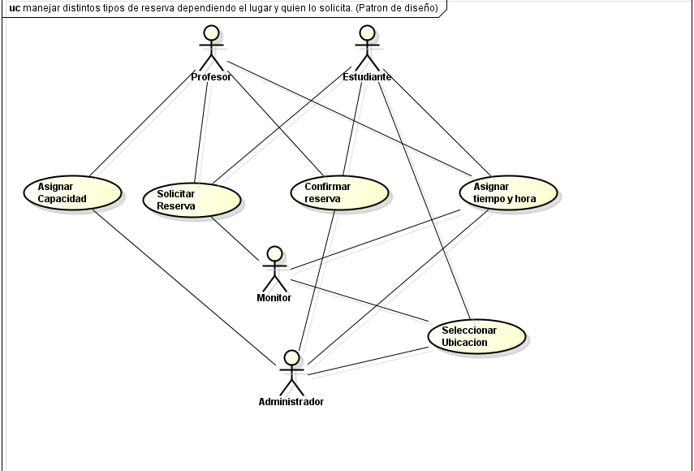
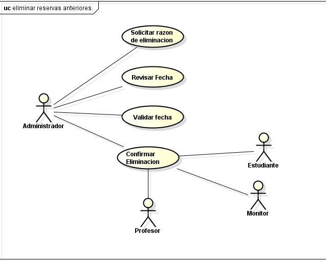

# DOSW_ParcialT1_JuanMoreno
primer parcial de ciclos Juan Moreno

## 1. Diagrama de contexto

## 2. Patrones de diseño elegidos
### Primero
a) nombre del patron: Factory method
b) tipo de patron: Creacional
c) Justificacion: ya que este patron es una "fabrica" por decirlo asi que crea todos los objetos, en este caso nuestra fabrica es la reservacion  los objetos que se crean son el area u objeto elegido como un salon, oficina o un equipo (PC)

### Segundo 
a) nombre del patron: Abstract factory
b) tipo de patron: Creacional
c) Justificacion: debido a que este patron nos permite crear familias de objectos que sean similares entre si, aqui todo lo que se reserva tienen aspectos en comun como ubicacion, capacidad, tiempo de reserva, etc.

## 3. requerimientos

### funcionales

Silabinfo tiene que tener la posibilidad de:

1. manejar distintos tipos de reserva dependiendo el lugar y quien lo solicita. (Patron de diseño)
2. gestionar el tiempo de cada reserva.
3. eliminar reservas anteriores, vencidas o canceladas con su respectiva razon.

### no funcionales 

Silabinfo debe:

1. Manejar los colores representativos de la decanatura de ingenieria de sistemas.
2. Gestionar la disponibilidad de operacion.

# 4. Casos de uso

### Caso Manejar distintos tipos de reservas

